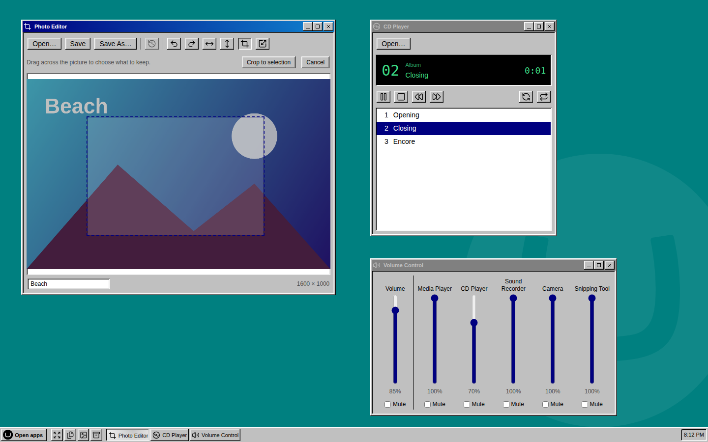

# UmbraDesktop Multimedia

Sound, pictures and video for UmbraDesktop. The programs Windows kept beside its Accessories, from Media Player to the Snipping Tool, each in a window of its own on the desktop and each working with the files in your media library.

[](https://www.nuget.org/packages/Umbraco.Community.UmbraDesktop.Multimedia) [](https://www.nuget.org/packages/Umbraco.Community.UmbraDesktop.Multimedia) [](../../LICENSE)


Install it and the launcher grows a Multimedia group. Open one of its programs and it gets a window like everything else, in whichever theme you picked.

- **Media Player and CD Player.** Play the sound and video in your media library without downloading it first, or a whole folder of sound track by track, with shuffle and repeat.
- **Picture Viewer and Photo Editor.** Look through a folder of pictures, one by one or as a slideshow, then crop, rotate, flip or resize one and save it back.
- **Sound Recorder, Camera and Snipping Tool.** Record a clip with your microphone, take a photo or video with your webcam, or capture your screen, and add it straight to the media library.
- **Media Info and Volume Control.** See everything about a file, down to the camera that took a photo, and turn all the desktop's sound down at once.



## Get started

```bash
dotnet add package Umbraco.Community.UmbraDesktop.Multimedia
```

That is all. UmbraDesktop comes with it if you do not have it yet, and the programs appear in the launcher for anyone who can reach the desktop. You need Umbraco 17 and .NET 10.

[Multimedia](docs/user/multimedia.md) has a page for each program, and explains how versions of this package and UmbraDesktop fit together.

## Writing your own

Nothing in here is privileged. Each program is a `umbraDesktopApp` manifest, the public route any package can use, and the Multimedia group comes from the package's own `umbraDesktopCatalogue` manifest. So the source of this package is a worked example for putting your own app on the desktop. See [Building a desktop app](../../docs/developer/desktop-apps.md).

## License

[MIT](../../LICENSE)
