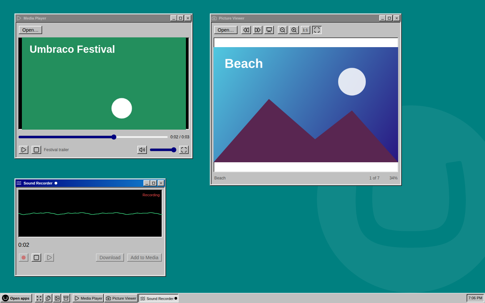

# UmbraDesktop Multimedia

Sound and pictures for UmbraDesktop. Media Player, Picture Viewer and Sound Recorder, the programs Windows kept beside its Accessories, each in a window of its own on the desktop and each working with the files in your media library.

[](https://www.nuget.org/packages/Umbraco.Community.UmbraDesktop.Multimedia) [](https://www.nuget.org/packages/Umbraco.Community.UmbraDesktop.Multimedia) [](../../LICENSE)



Install it and the launcher grows a Multimedia group. Open one of its programs and it gets a window like everything else, in whichever theme you picked.

- **Media Player.** Play the sound and video in your media library, without downloading it first.
- **Picture Viewer.** Open a picture and look through the rest of its folder, one by one or as a slideshow, zoomed to fit or to the pixel.
- **Sound Recorder.** Record a quick clip with your microphone, play it back, and download it or add it to the media library.

## Get started

```bash
dotnet add package Umbraco.Community.UmbraDesktop.Multimedia
```

That is all. UmbraDesktop comes with it if you do not have it yet, and the programs appear in the launcher for anyone who can reach the desktop. You need Umbraco 17 and .NET 10.

[Multimedia](docs/user/multimedia.md) has a page for each program, and explains how versions of this package and UmbraDesktop fit together.

## Writing your own

Nothing in here is privileged. Each program is a `umbraDesktopApp` manifest, the public route any package can use, and the Multimedia group comes from the package's own `umbraDesktopCatalogue` manifest. So the source of this package is a worked example for putting your own app on the desktop. See [Building a desktop app](../../docs/developer/desktop-apps.md).

## License

[MIT](../../LICENSE)
